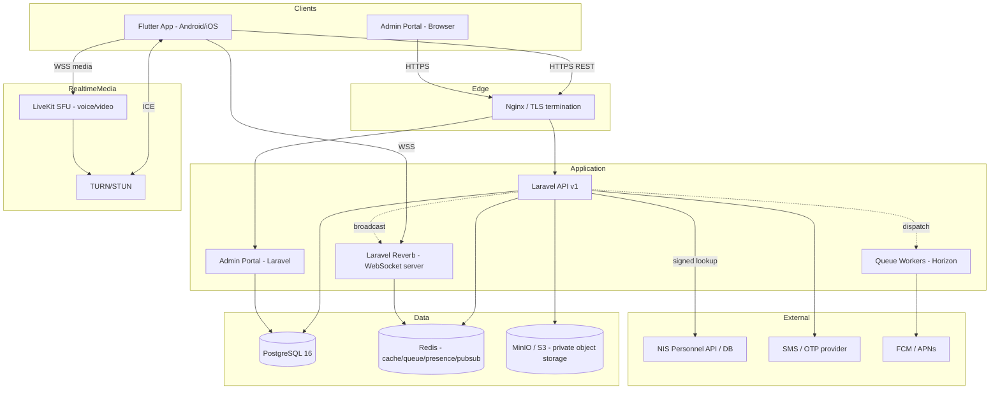
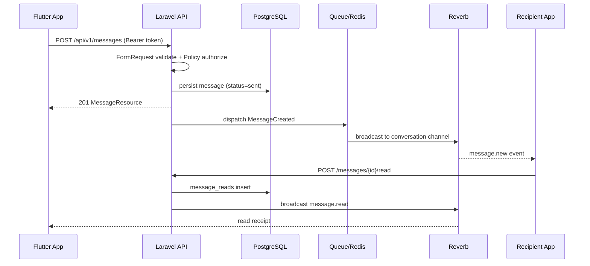
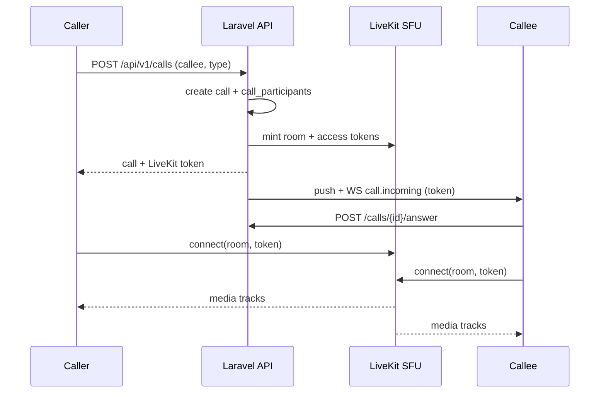
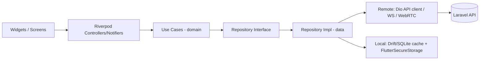
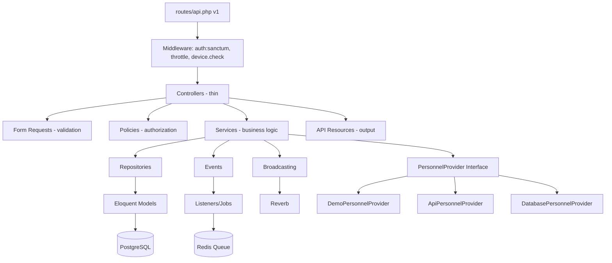
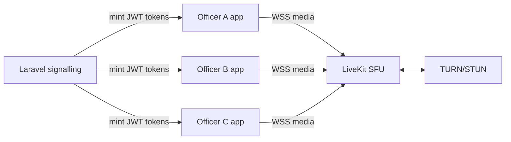
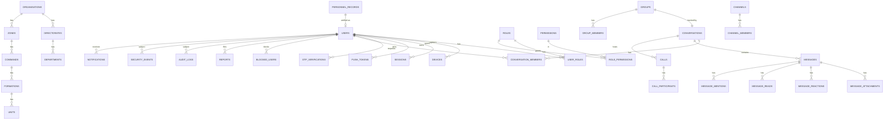

# NISconnect — System Architecture

**NISconnect** is the secure internal communication platform for authorised officers and
personnel of the Nigeria Immigration Service (NIS). This document is the authoritative
architecture reference. It covers the system, mobile, backend, real‑time, WebRTC and
security architectures, the data model (ERD + schema), the API surface, the Service Number
onboarding sequence, the repository layout and the delivery roadmap.

> **Identity rule (non‑negotiable):** Every officer begins registration with a **numeric**
> Service Number. It is verified against the authorised NIS personnel source, and the
> officer's existing personnel record is retrieved **before** account creation can continue.
> The Service Number is stored and displayed as digits only — never `NIS/`, never with a
> separator, never coerced to an integer (leading zeroes are preserved).

---

## 1. System architecture

NISconnect is a monorepo of four cooperating systems:

| Component | Technology | Responsibility |
|-----------|-----------|----------------|
| **Mobile app** | Flutter + Dart (Android/iOS) | Officer‑facing client. Clean Architecture, Riverpod state, secure local storage. |
| **Backend API** | Laravel 11 + PHP 8.4 | Versioned REST API, business logic in services, auth, personnel verification, messaging, media, call signalling. |
| **Admin portal** | Laravel (Blade + server‑rendered) | Separate, RBAC‑gated web console for NIS administrators. Never exposed to mobile clients. |
| **Infrastructure** | PostgreSQL, Redis, Reverb (WebSockets), Nginx, MinIO/S3, LiveKit (SFU), queue workers | Durable data, real‑time transport, media storage, group calling, background jobs. |



**Design tenets**

- **Separation of concerns.** Controllers are thin; logic lives in Services, authorisation
  in Policies, validation in Form Requests, output shaping in API Resources.
- **Adapter isolation for external systems.** The NIS personnel source, SMS provider, push
  provider and object store are all behind interfaces so real infrastructure connects later
  without rewrites.
- **Real‑time first.** WebSockets (not polling) carry message/presence/typing events; Redis
  is the fan‑out backplane.
- **Security by design.** RBAC + organisational scoping, audit logging, encrypted secrets,
  Argon2id password hashing, hashed OTPs, private media with signed URLs.

---

## 2. Architecture diagram (request lifecycles)

**Message send (real‑time path):**



**Voice/video call signalling (LiveKit SFU):**



---

## 3. Mobile architecture (Flutter)

Clean Architecture with a feature‑first layout. Three layers per feature:

```
presentation  ->  domain  ->  data
(widgets +        (entities +   (models + DTOs +
 Riverpod          use cases +   repository impls +
 controllers)      repo iface)   remote/local sources)
```



- **State management:** **Riverpod** (chosen, used consistently). Async state via
  `AsyncNotifier`; dependency injection via providers.
- **Networking:** `dio` with interceptors (auth token, refresh‑on‑401, retry with backoff,
  offline queueing).
- **Real‑time:** `web_socket_channel` / Pusher protocol client to Reverb; reconnection with
  exponential backoff and resubscribe.
- **WebRTC:** `livekit_client` for 1:1 and group calls; `flutter_callkit_incoming` +
  `firebase_messaging` for incoming call UX.
- **Local persistence:** Drift (SQLite) for the conversation/message cache and the offline
  outbox; `flutter_secure_storage` (Android Keystore / iOS Keychain) for tokens, PIN hash
  salt and key material.
- **Design system:** central `AppColors` (professional green), `AppTypography` (**Arial**
  everywhere), `AppTheme` (light/dark/system). See `docs/DESIGN_SYSTEM.md`.

**Folder layout** — see §11.

---

## 4. Backend architecture (Laravel)



**Layered responsibilities**

- **Controllers** orchestrate only: validate (Form Request) → authorize (Policy) → call a
  Service → return an API Resource.
- **Services** hold all business rules (`ServiceNumberVerifier`, `OtpService`,
  `DeviceRegistrar`, `MessageService`, `DirectoryService`, `CallService`).
- **Repositories** wrap query concerns where reuse/testability warrants it.
- **Events/Listeners/Jobs** decouple side effects (broadcast, push, audit, media
  processing) onto the queue.
- **Policies** enforce per‑resource authorization; **Gates + role checks** enforce RBAC and
  organisational scope.

**Personnel provider selection** is via `config('personnel.provider')` bound in a service
provider — `demo` (dev only), `api`, or `database`. Production is guarded: the `demo`
provider throws if `APP_ENV=production`.

---

## 5. WebRTC / calling architecture

- **1:1 calls** and **group calls** both use an **SFU (LiveKit)** rather than a P2P mesh, so
  large group calls scale (each client sends one upstream, receives N downstreams selectively).
- The **Laravel API is the signalling authority**: it authenticates the caller, checks
  policy (blocking, privacy, group membership), creates `calls`/`call_participants`, and
  **mints short‑lived LiveKit access tokens** (JWT signed with the LiveKit API secret, which
  never leaves the backend).
- **TURN/STUN** for NAT traversal. Media is DTLS‑SRTP encrypted in transit by WebRTC.
- **Incoming call delivery** even when the app is closed: high‑priority FCM data message →
  Android `ConnectionService`/CallKit‑style UI; APNs VoIP push → iOS **CallKit**.
- **Call states:** calling, ringing, connected, reconnecting, ended, missed, declined, failed —
  persisted on `calls` and streamed over the call WebSocket channel.



---

## 6. Security architecture

Layered defence — see `docs/SECURITY.md` for the full model.

- **Transport:** HTTPS/TLS everywhere; HSTS; secure headers (CSP, X‑Frame‑Options,
  X‑Content‑Type‑Options, Referrer‑Policy).
- **AuthN:** Service Number + phone/OTP onboarding; login by Service Number + PIN/password;
  device binding; biometric unlock (device‑local only — raw biometrics never leave the
  device and are never sent to the server). Tokens via **Laravel Sanctum** with refresh +
  rotation and per‑device abilities.
- **AuthZ:** RBAC (6 roles) + **organisational scoping** (a Directorate admin cannot act on
  another Directorate). Enforced **server‑side** in Policies/Gates — never by hiding UI.
- **Secrets:** Argon2id for passwords/PINs; **OTPs stored only as hashes**; personnel/API/
  encryption keys live only in server env, never in the mobile app.
- **Abuse resistance:** rate limiting + lockout on auth, OTP and directory search;
  brute‑force protection; anti‑enumeration responses for Service Number lookups.
- **Data protection:** encryption in transit (TLS) and at rest (DB volume + encrypted
  columns for sensitive fields); private object storage with time‑limited signed URLs and
  ownership checks.
- **Auditability:** append‑only `audit_logs` and `security_events`; admin actions are
  themselves audited.
- **Message security:** TLS in transit + encrypted at rest server‑side. E2EE is **not**
  claimed by default (the platform is an authorised internal system with administrative
  audit obligations); the transport is designed so a reviewed protocol (e.g. Signal) can be
  layered on later for designated channels. `docs/SECURITY.md` documents exactly what is and
  is not encrypted, who holds keys, and what administrators can access.

---

## 7. Database ERD



## 8. Complete database schema

Conventions: UUID primary keys (`id uuid default gen_random_uuid()`), `created_at`/
`updated_at`, `deleted_at` (soft delete) where noted, foreign keys with `on delete`
behaviour, indexes on all lookup/foreign‑key columns.

**Organisational hierarchy**
```
organisations(id, name, code UNIQUE, created_at, updated_at)
directorates(id, organisation_id FK, name, code UNIQUE, created_at, updated_at)
departments(id, directorate_id FK, name, code, created_at, updated_at)
zones(id, organisation_id FK, name, code UNIQUE, created_at, updated_at)
commands(id, zone_id FK, name, code, created_at, updated_at)
formations(id, command_id FK, name, code, type, created_at, updated_at)
units(id, formation_id FK, name, code, created_at, updated_at)
```

**Identity & personnel**
```
personnel_records(
  id, service_number VARCHAR(20) UNIQUE NOT NULL CHECK (service_number ~ '^[0-9]+$'),
  surname, first_name, other_name NULL, rank, directorate, department, zone,
  command, formation, unit, posting, official_email NULL, status,  -- active|retired|suspended|dismissed
  photo_path NULL, source, source_synced_at, created_at, updated_at)

users(
  id, personnel_record_id FK UNIQUE, service_number VARCHAR(20) UNIQUE NOT NULL,
  phone VARCHAR(20) NULL, phone_verified_at NULL,
  display_name, avatar_path NULL,
  password_hash NULL,        -- Argon2id (login password, optional)
  pin_hash NULL,             -- Argon2id (app PIN)
  account_state,             -- pending|active|suspended|locked|disabled|inactive
  last_seen_at NULL, presence,  -- online|offline|away
  privacy JSONB,             -- last_seen/online/receipts/typing/photo/calls/invites visibility
  created_at, updated_at, deleted_at)
```

**RBAC**
```
roles(id, name UNIQUE, label, scope_type NULL, description)  -- super_admin|nis_admin|directorate_admin|group_admin|security_admin|officer
permissions(id, name UNIQUE, label, group)
role_permissions(role_id FK, permission_id FK, PRIMARY KEY(role_id,permission_id))
user_roles(id, user_id FK, role_id FK, scope_type NULL, scope_id NULL, granted_by NULL, created_at)
```

**Devices & sessions**
```
devices(id, user_id FK, name, platform, model NULL, os_version NULL, app_version NULL,
        push_token NULL, last_active_at, status, created_at, updated_at)  -- status: active|revoked
sessions(id, user_id FK, device_id FK, token_id, ip NULL, user_agent NULL,
         last_activity_at, revoked_at NULL, created_at)
push_tokens(id, user_id FK, device_id FK, provider, token, created_at, updated_at)  -- provider: fcm|apns
```

**OTP**
```
otp_verifications(id, user_id FK NULL, phone, purpose, code_hash, attempts, max_attempts,
                  expires_at, consumed_at NULL, last_sent_at, resend_count, created_at)
```

**Conversations & messages**
```
conversations(id, type, title NULL, avatar_path NULL, group_id NULL, channel_id NULL,
              last_message_id NULL, created_by, created_at, updated_at)  -- type: direct|group|channel
conversation_members(id, conversation_id FK, user_id FK, role, muted_until NULL,
                     last_read_message_id NULL, joined_at, left_at NULL,
                     UNIQUE(conversation_id,user_id))
messages(id, conversation_id FK, sender_id FK, type, body NULL, reply_to_id NULL,
         forwarded_from_id NULL, edited_at NULL, pinned_at NULL, status,
         created_at, updated_at, deleted_at)  -- type: text|image|video|document|audio|voice|system
message_attachments(id, message_id FK, media_file_id FK, kind, created_at)
message_reactions(id, message_id FK, user_id FK, emoji, created_at, UNIQUE(message_id,user_id,emoji))
message_reads(id, message_id FK, user_id FK, read_at, UNIQUE(message_id,user_id))
message_mentions(id, message_id FK, mentioned_user_id FK, created_at)
```

**Groups & channels**
```
groups(id, conversation_id FK, name, description NULL, avatar_path NULL, type,
       org_scope_type NULL, org_scope_id NULL, created_by, permissions JSONB,
       created_at, updated_at, deleted_at)   -- type: standard|organisational
group_members(id, group_id FK, user_id FK, role, permissions JSONB NULL,
              added_by NULL, created_at, UNIQUE(group_id,user_id))  -- role: owner|admin|moderator|member
channels(id, name, description NULL, avatar_path NULL, org_scope_type NULL,
         org_scope_id NULL, created_by, created_at, updated_at, deleted_at)
channel_members(id, channel_id FK, user_id FK, role, created_at, UNIQUE(channel_id,user_id))  -- role: publisher|subscriber
```

**Calls**
```
calls(id, conversation_id FK NULL, type, mode, initiator_id FK, room_name UNIQUE,
      status, started_at NULL, ended_at NULL, created_at)  -- type: voice|video ; mode: direct|group
call_participants(id, call_id FK, user_id FK, state, joined_at NULL, left_at NULL,
                  UNIQUE(call_id,user_id))  -- state: ringing|joined|left|declined|missed
call_sessions(id, call_id FK, user_id FK, device_id FK NULL, connect_quality NULL, created_at)
```

**Media**
```
media_files(id, owner_id FK, disk, path, mime, extension, size_bytes, width NULL,
            height NULL, duration_ms NULL, thumbnail_path NULL, checksum, scan_status,
            created_at)  -- scan_status: pending|clean|infected|failed
voice_notes(id, message_id FK, media_file_id FK, duration_ms, waveform JSONB, created_at)
```

**Safety, notifications, audit**
```
blocked_users(id, blocker_id FK, blocked_id FK, created_at, UNIQUE(blocker_id,blocked_id))
reports(id, reporter_id FK, target_type, target_id, reason, details NULL, status,
        reviewed_by NULL, reviewed_at NULL, created_at)  -- status: open|reviewing|actioned|dismissed
notifications(id, user_id FK, type, title, body, data JSONB, read_at NULL, created_at)
audit_logs(id, actor_id NULL, action, resource_type NULL, resource_id NULL, result,
           ip NULL, device_id NULL, metadata JSONB, created_at)   -- append-only
security_events(id, user_id NULL, event, severity, ip NULL, device_id NULL,
                metadata JSONB, created_at)                       -- append-only
```

Indexes of note: `messages(conversation_id, created_at)`, `conversation_members(user_id)`,
`personnel_records(service_number)`, GIN full‑text index on `messages.body` for search,
`audit_logs(actor_id, created_at)`.

---

## 9. API architecture

Versioned REST under `/api/v1`. JSON only. Bearer (Sanctum) auth except the public
onboarding endpoints. Cursor pagination for message/large lists. See
`docs/API.md` and the generated OpenAPI spec for the full contract.

```
/api/v1/auth        register (svc no) · verify-service-number · confirm-identity ·
                    request-otp · verify-otp · set-credentials · login · refresh · logout
/api/v1/personnel   verify (server-side lookup only)
/api/v1/users       me · update profile · privacy · presence
/api/v1/directory   search (rate-limited) · {serviceNumber}
/api/v1/chats       index · show · create · read
/api/v1/messages    index (cursor) · store · show · update · destroy · react · pin · forward · search
/api/v1/groups      index · store · show · update · members · roles · leave · archive · destroy
/api/v1/channels    index · show · posts · publish · subscribe
/api/v1/calls       store · answer · decline · end · token · history
/api/v1/media       upload · {id} (signed) · thumbnail
/api/v1/notifications index · read · read-all · settings
/api/v1/devices     index · destroy · destroy-all
/api/v1/safety      block · unblock · report
```

Every endpoint: Form Request validation → Policy authorization → Service → API Resource.
Errors return a stable envelope `{ "message": "...", "errors": {...} }` with no stack traces
or internal detail leaked.

---

## 10. Service Number onboarding sequence

```mermaid
sequenceDiagram
    participant App as Flutter App
    participant API as NISconnect API
    participant PV as PersonnelVerificationService
    participant SRC as NIS Personnel Source
    participant SMS as OTP Provider

    App->>API: POST /auth/verify-service-number {service_number:"001234"}
    API->>API: validate digits-only + length (config)
    API->>PV: lookup(001234)
    PV->>SRC: secure lookup
    SRC-->>PV: personnel record (authorised fields) | not found
    alt found & authorised
      API->>API: create pending verification token
      API-->>App: 200 {record: authorised fields, verification_id}
      App->>App: show "PERSONNEL RECORD FOUND" -> [This is me]
      App->>API: POST /auth/confirm-identity {verification_id, phone}
      API->>SMS: send OTP to phone
      API-->>App: 200 {otp sent}
      App->>API: POST /auth/verify-otp {verification_id, code}
      API->>API: verify hash, attempts, expiry
      App->>API: POST /auth/set-credentials {verification_id, pin, device}
      API->>API: create user(active) + device + session + tokens; audit
      API-->>App: 201 {access_token, refresh_token, user}
    else not found
      API-->>App: 200 generic {verified:false} "We could not verify this Service Number."
    end
```

Anti‑enumeration: the not‑found path returns the same shape/timing envelope and is rate
limited + audited; it never distinguishes "no such number" from "exists but not authorised".

---

## 11. Project folder structure

```
nisconnect/
├── mobile/                     # Flutter app (Android + iOS)
│   ├── lib/
│   │   ├── core/               # theme, config, network, error, di, router, storage
│   │   ├── features/           # auth, chat, calls, directory, groups, channels,
│   │   │   └── <feature>/       #   settings — each: presentation/ domain/ data/
│   │   ├── services/           # websocket, webrtc, push, presence
│   │   ├── models/             # shared DTOs
│   │   ├── repositories/       # cross-feature repos
│   │   └── shared/             # widgets, extensions, utils
│   ├── assets/                 # logos, images, icons (from /assets)
│   ├── android/  ├── ios/
│   ├── test/     └── integration_test/
│
├── backend/                    # Laravel 11 API
│   ├── app/
│   │   ├── Http/{Controllers,Requests,Resources,Middleware}
│   │   ├── Models/  ├── Policies/  ├── Services/  ├── Repositories/
│   │   ├── Personnel/          # PersonnelProvider interface + Demo/Api/Database
│   │   ├── Events/  ├── Listeners/  ├── Jobs/  ├── Notifications/
│   ├── routes/{api.php,channels.php}
│   ├── database/{migrations,seeders,factories}
│   ├── config/  └── tests/{Unit,Feature}
│
├── admin/                      # Admin portal (Laravel Blade) — or module in backend/
├── infrastructure/             # docker-compose, Dockerfiles, nginx, deploy scripts
├── docs/                       # this + API, DB, SECURITY, DESIGN_SYSTEM, DEPLOYMENT, ...
├── assets/                     # provided NIS logo + HQ images (source of truth)
└── README.md
```

---

## 12. Development roadmap

| Phase | Deliverable | Testable here? |
|------:|-------------|----------------|
| 1 | Repo + architecture + design system | ✅ docs |
| 2 | PostgreSQL schema + Laravel foundation (org, users, personnel, devices, otp, audit) | ✅ migrations run |
| 3 | Service Number verification + OTP + device registration + auth | ✅ feature tests |
| 4 | Personnel integration providers + officer directory (rate‑limited search) | ✅ feature tests |
| 5 | Private messaging (REST + broadcast events) | ✅ feature tests |
| 6 | Group messaging + organisational groups | ✅ feature tests |
| 7 | Media/document sharing (private storage, signed URLs, thumbnails) | ✅ feature tests |
| 8 | Voice notes | ✅ backend; ⚠️ device audio needs Flutter |
| 9–11 | Voice / video / group calls (LiveKit signalling + tokens) | ✅ signalling tests; ⚠️ media needs devices |
| 12 | Push notifications (FCM/APNs adapters) | ⚠️ needs provider creds |
| 13 | Device management + security hardening | ✅ feature tests |
| 14 | Official channels | ✅ feature tests |
| 15 | Administration portal (RBAC) | ✅ feature tests |
| 16 | Testing + security validation | ✅ |
| 17 | Performance (indexes, pagination, caching, queues) | ✅ |
| 18 | Production deployment prep (Docker, CI/CD, backups) | ✅ config |

**Environment note for this build:** the Laravel backend + PostgreSQL run and are tested in
CI/dev here. The Flutter app is written to spec but **cannot be compiled in this environment**
(no Flutter SDK installed); it builds where a Flutter toolchain is present. External
integrations (real NIS personnel source, SMS, FCM/APNs, LiveKit) run through adapters with
development implementations and connect to production infrastructure via `.env` without code
changes.
